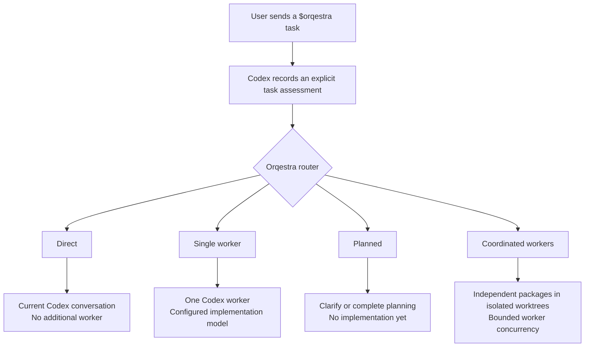

# Orqestra

**Route smarter. Build longer.**
**Spend Codex effort where it matters.**

Orqestra is an open-source, configurable orchestrator for coding work inside Codex. It routes each task to the smallest workflow that can handle it responsibly: small work stays in the current conversation, standard work can use one focused worker, and multiple workers are reserved for genuinely independent packages.

This approach is designed to reduce avoidable model turns and token consumption while keeping verification explicit. You choose the model policy, worker limits, retry limits, and whether a task should remain with one worker or use coordinated packages.

[🚀 Quick install](#quick-installation) · [🧭 How it works](#how-it-works) · [⌨️ Important commands](#important-commands) · [🧰 Manual installation](docs/INSTALLATION.md)

**Status: public alpha (`0.1.0-alpha.2`).** Configuration, model policies, route previews, read-only Codex model discovery, project-local setup and upgrades, durable bounded worker execution, isolated multi-package coordination, measured worker token reports, and paired evaluation are implemented. Token savings depend on the task, policy, and models available to the user; no fixed savings percentage has been established.

<a id="safe-token"></a>

## 🛡️ Orqestra Safe Token strategy

The goal is simple: avoid spending flagship reasoning on every step when a smaller route can complete the work responsibly. Orqestra does not make GPT-6 Astra consume fewer tokens. It changes **where and when** a flagship model is used.

An Orqestra policy can reserve Astra for selected planning, review, or escalation decisions while Luna or Terra handles bounded routine implementation. Small work can stay in the current conversation with no added worker at all. The exact assignment remains configurable and is checked against the models available to the user's Codex account.


> **Illustrative routing pattern:** the token blocks show how work is allocated, not measured token counts or a promised savings percentage. Actual consumption depends on the task, context, selected policy, model behavior, retries, and available account models.

Orqestra controls avoidable orchestration work before workers are started:

| Mechanism | How it controls model work |
| --- | --- |
| Direct route | Small, clear, low-risk work stays in the current Codex conversation, so no additional worker is started. |
| Selective delegation | A standard task uses one implementation worker instead of creating a swarm. |
| Focused contracts | Workers receive the objective, acceptance criteria, allowed scope, and verification commands instead of the entire parent conversation. |
| Configurable model policy | Economy, Balanced, Quality, and custom policies decide which configured model is eligible for each role. |
| Hard worker limits | `maxWorkers` and `maxPremiumWorkers` cap active implementation workers. |
| Bounded retries | `maxAttempts` prevents an open-ended repair loop. |
| Deterministic checks | Verification commands and coordinated integration run without adding a model turn. |
| Honest accounting | Reports include worker tokens exposed by Codex and identify missing telemetry instead of estimating it. |

This is what **Safe Token** means in Orqestra: direct work when sufficient, focused context when a worker helps, explicit use of premium models, bounded concurrency, bounded repair attempts, and deterministic checks that do not start another model turn. The main Codex conversation remains outside the helper's token visibility. Account-level usage is account-wide, and a preview is not evidence of savings. Orqestra includes a paired benchmark format so future public comparisons can use the same task, Git base, checks, and measured observations.

<a id="how-it-works"></a>

## 🧭 How Orqestra works

After installation, Orqestra is available as a project skill. In the current alpha, activate it explicitly by starting the request with `$orqestra`:

```text
$orqestra assess, plan, and implement CSV export, then verify the result.
```

A plain request such as `Plan and implement CSV export` is handled as a normal Codex request; Orqestra is not guaranteed to run. Using `$orqestra` makes the routing request explicit.



| Route | When it is selected | What runs |
| --- | --- | --- |
| **Direct** | The task is small, clear, low-risk, and one package. | The current Codex conversation; zero additional workers. |
| **Single worker** | The task is standard, clear, low-risk, and one package. | One bounded implementation worker followed by independent verification. |
| **Planned** | The task is complex, unclear, high-risk, or not ready for safe execution. | Planning and clarification; implementation waits until the contract is clear. |
| **Coordinated workers** | The task contains two or more independently completable packages with explicit, nonoverlapping ownership. | Bounded package workers in isolated worktrees, followed by deterministic integration and final verification. |

### 🎛️ The user controls the worker strategy

Ask Orqestra to avoid coordination and use no more than one additional worker:

```text
$orqestra implement this task with no more than one additional worker. Do not coordinate parallel packages.
```

Set a project-wide limit of one active implementation worker:

```text
$orqestra set maxWorkers to 1 and maxPremiumWorkers to 1. Change only orqestra.config.json and validate it.
```

With `maxWorkers` set to `1`, a multi-package coordination contract can still process packages sequentially. To allow parallel work, raise the limit and request coordination:

```text
$orqestra coordinate these independent packages using no more than 3 workers, then verify their integration.
```

Orqestra validates the requested shape. It does not force a single-worker execution contract onto an unclear or high-risk task, and it does not invent independent packages just to create more workers.

### 🧠 Models and workers are separate choices

A worker is a Codex task with its own context. A model is the GPT model assigned to that worker. The policy selects from configured model candidates at the start of a run and checks runtime availability before live execution.

```text
$orqestra show my available models, then change the implement role to GPT-6 Astra with high reasoning. Validate the policy and show the exact change.
```

The current alpha keeps repair attempts on the same implementation model and worker thread. Package workers in one coordinated run use the same selected implementation model. It does not silently switch models after a failure, and it never changes the model selected for the main Codex conversation.

## 🗺️ Project direction

- Economy, Balanced, Quality, and custom model policies.
- Role definitions independent of model names, including GPT-5.6 and GPT-6 Astra presets.
- Direct work for small tasks; delegation when it has a concrete benefit.
- Bounded retries, targeted verification, resumable work, and honest usage reporting.
- Compatibility checks before live execution, with no silent switch from subscription usage to API billing.

The [public roadmap](https://github.com/MoBarakat313/Orqestra/blob/main/docs/ROADMAP.md) describes the verified alpha, current priorities, and design commitments. The project contains original implementation; third-party reference checkouts are not distributed.

<a id="quick-installation"></a>

## 🚀 Quick installation with Codex

The public alpha requires [Node.js 22 or newer](https://nodejs.org/en/download) and npm. Open the project you want to use in Codex Desktop, then paste this as one prompt:

```text
Install Orqestra in the project currently open in Codex from the latest release at https://github.com/MoBarakat313/Orqestra/releases.

First check that Node.js 22 or newer and npm are available. If either is missing, stop and explain what I need to install; do not install or upgrade Node.js, npm, or Codex automatically.

Download only the versioned mobarakat313-orqestra-<version>.tgz release asset and SHA256SUMS.txt into a temporary directory. Do not use GitHub's Source code archive. Verify the archive against SHA256SUMS.txt and stop if verification fails.

Install the verified archive globally with npm without sudo. Then run Orqestra setup for the currently open project using the Balanced profile. Verify the installation with skill-status and run doctor. Report a doctor compatibility failure separately; it does not mean that project installation failed.

Preserve all existing project instructions, skills, Codex settings, configuration, and user files. Remove the temporary download files when finished. Report the installed version, files added to the project, doctor result, and whether Codex needs to be reloaded.
```

The prompt authorizes installation of the verified Orqestra package and setup of the currently open project. Codex should stop and explain the problem if a prerequisite, checksum, package installation, or project integrity check fails. See the [quick-install procedure](docs/QUICK_INSTALL.md) for the expected result.

## 🧰 Manual installation

Prefer to run each command yourself? The [manual installation guide](docs/INSTALLATION.md) has separate macOS, Linux, and Windows PowerShell instructions, including checksum verification, project setup, troubleshooting, upgrades, and removal.

After either installation path, open or reload the project. Orqestra should appear in the Skills section of the Codex sidebar. Setup creates `orqestra.config.json` and `.agents/skills/orqestra/` while preserving existing project instructions, Codex settings, and unrelated skills.

**Next: [learn the important Orqestra commands](#important-commands).**

<a id="important-commands"></a>

## ⌨️ Important commands for beginners

Use prompts beginning with `$orqestra` in Codex chat. Use commands beginning with `orqestra` in a terminal.

| What you want | Paste into Codex |
| --- | --- |
| Preview a task safely | `$orqestra preview a plan for adding CSV export, including tests.` |
| Implement and verify | `$orqestra implement the CSV export using the current project policy and verify the result.` |
| Check installation health | `$orqestra check this project's installation status and run diagnostics.` |
| See available models | `$orqestra show the models available to my Codex account and explain the current role assignments. Do not change anything.` |
| Change a role's model | `$orqestra change the implement role to GPT-6 Astra with high reasoning. Change only orqestra.config.json, validate it, and show the exact change.` |
| Change worker limits | `$orqestra set this project to at most 3 workers and 1 premium worker. Change only orqestra.config.json and validate it.` |
| Resume interrupted work | `$orqestra resume run <run-id> using the same task contract.` |
| Coordinate independent work | `$orqestra coordinate these independent packages: update packages/api and packages/client, then run the repository checks.` |
| Inspect visible usage | `$orqestra inspect the available account and worker usage information and explain any visibility gaps.` |

For model or limit changes, Orqestra first checks the current policy and validates the edited file. The alpha does not have an interactive `configure` terminal command. Configuration declarations do not prove that a model is available, so use model discovery before live execution. Orqestra never changes the model selected for the main Codex conversation.

The [beginner command guide](docs/BEGINNER_COMMANDS.md) explains profiles, model changes, status checks, updates, removal, execution, recovery, usage, and every terminal command included in the alpha.

## 🔄 Manage the project skill

Inspect, upgrade, or remove a project installation:

```sh
orqestra skill-status --project /absolute/path/to/your-project
orqestra upgrade-skill --project /absolute/path/to/your-project
orqestra uninstall-skill --project /absolute/path/to/your-project
```

Upgrades and removal verify every manifest-owned artifact. They refuse local changes, added files, symlinks, or unrecognized ownership rather than overwrite them. A schema 1 policy can be upgraded separately:

```sh
orqestra migrate-config --config /absolute/path/to/orqestra.config.json
```

Migration keeps the original as `orqestra.config.json.v1.bak`. Skill removal leaves policies and backups in place.

## 🔍 Discover models

```sh
orqestra models --json
orqestra models --config orqestra.config.json --output catalog.json
orqestra plan --task examples/task.json --catalog catalog.json
```

Use `--codex /path/to/codex` if the default CLI is incompatible. A native executable or the official package's `bin/codex.js` entrypoint is supported. Model discovery uses the existing runtime/account state; it never requests login or starts a model turn. Account emails and credentials are excluded from reports. The Codex process can maintain its own normal logs/caches.

See [configuration and command documentation](docs/CONFIGURATION.md) and [tested compatibility](docs/COMPATIBILITY.md). The alpha is distributed as a versioned GitHub release archive and is not published to the npm registry.

## 🛠️ Run a durable verified worker

Create an execution contract from [examples/execution.json](examples/execution.json), use a disposable clean Git repository or worktree, then run:

```sh
orqestra run \
  --request /absolute/path/to/execution.json \
  --project /absolute/path/to/project \
  --config /absolute/path/to/orqestra.config.json
```

This creates a checkpoint under the repository's private Git metadata, starts a Codex worker with project-only writes and no network, and runs the declared checks independently. Failed verification can start a repair turn up to the policy's `maxAttempts`. Every check must pass before the result says `succeeded`.

If the App Server connection ends unexpectedly, `run` returns `paused` with a run ID. Resume with the same project, request, and policy:

```sh
orqestra resume \
  --run-id <id-from-run-report> \
  --request /absolute/path/to/execution.json \
  --project /absolute/path/to/project \
  --config /absolute/path/to/orqestra.config.json
```

Resume verifies detected edits before starting another turn and reopens the saved Codex thread for any repair. Approval requests are cancelled and reported by the CLI; Orqestra never grants them automatically. See [durable worker execution](docs/EXECUTION.md) for checkpoints, recovery, evidence, and failure behavior.

## 🧩 Coordinate independent packages

Create a strict multi-package contract from [examples/coordination.json](examples/coordination.json), then run:

```sh
orqestra coordinate \
  --request /absolute/path/to/coordination.json \
  --project /absolute/path/to/project \
  --config /absolute/path/to/orqestra.config.json
```

Orqestra creates one detached worktree per package, waits for declared dependencies, enforces total and premium worker limits, commits only verified in-scope package changes, and assembles them in a separate integration worktree. The original checkout remains unchanged. Success requires every final integration check to pass; the report gives the verified worktree path for review.

Use `coordinate-resume` with the reported run ID after a paused transport. Committed packages are not repeated. See [independent parallel work](docs/COORDINATION.md) for contract rules, scheduling, recovery, and integration behavior.

## 📊 Inspect usage and evaluate paired runs

```sh
orqestra usage --json
orqestra benchmark --input /absolute/path/to/benchmark.json --json
```

Worker reports keep input, cached input, cache-write input, output, reasoning-output, and total token categories when App Server exposes them. Missing or interrupted telemetry is reported as a visibility gap. ChatGPT account observations remain account-wide and are never converted to API cost; API-key reports do not invent organization billing data. The main Codex conversation remains outside the helper's visibility.

The benchmark command accepts direct Codex and Orqestra observations tied to the same task contract and Git base commit. It reports completion, verification, regressions, retries, elapsed time, and only fully paired measured token or API-cost differences. See [usage accounting and paired evaluation](docs/ACCOUNTING_AND_EVALUATION.md).

## 🧪 Development

```sh
npm ci
npm run check
npm pack --dry-run
```

See [CONTRIBUTING.md](https://github.com/MoBarakat313/Orqestra/blob/main/CONTRIBUTING.md) for the contribution workflow, the [public roadmap](https://github.com/MoBarakat313/Orqestra/blob/main/docs/ROADMAP.md) for current priorities, and [SECURITY.md](https://github.com/MoBarakat313/Orqestra/blob/main/SECURITY.md) for private vulnerability reporting.

## 📄 License

MIT. See [LICENSE](LICENSE).
